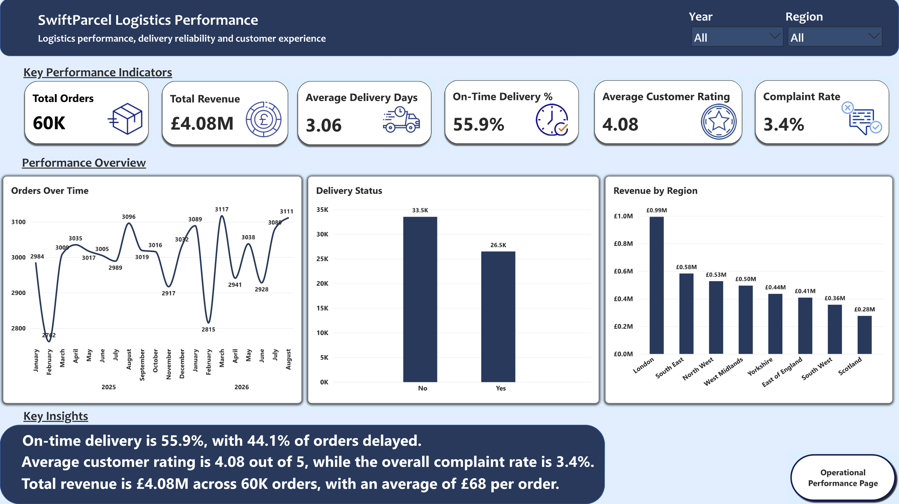
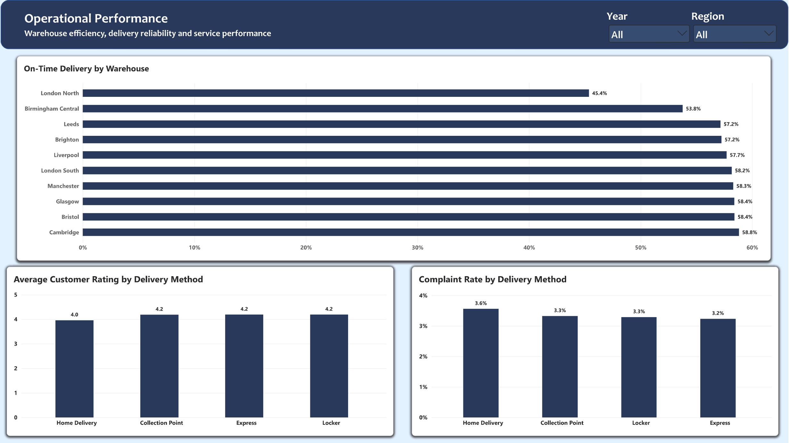

# SwiftParcel – Business Analysis & Data Analytics Project

## Project Overview

SwiftParcel is a synthetic logistics business analysis project created to analyse operational and customer data and identify insights that could support business decision-making.

The project uses a dataset containing **60,000 orders, 12,000 customers and 10 warehouses**. The analysis covers revenue, order performance, customer behaviour, delivery delays, warehouse performance and forecasting.

The project demonstrates the process of taking raw data through data preparation, analysis, visualisation and business recommendations.

## Objectives

- Analyse overall business and operational performance
- Identify revenue and order trends
- Examine customer behaviour and customer types
- Analyse delivery delays and order status
- Compare warehouse performance
- Identify trends that could support operational improvement
- Create forecasting analysis to support business planning
- Present findings clearly through an interactive Power BI dashboard

## Tools & Technologies

- **Excel / Google Sheets** – data analysis, calculations, pivot analysis and forecasting
- **SQL** – querying and analysing business data
- **Power Query** – data cleaning, transformation and validation
- **Power BI** – dashboard development and data visualisation
- **Data modelling** – fact and dimension tables with relationships between datasets

## Data & Structure

The project uses synthetic logistics data covering:

- 60,000 orders
- 12,000 customers
- 10 warehouses
- Customer information
- Warehouse information
- Delivery methods
- Calendar data
- Order values and dates
- Order status
- Delivery delays
- Customer ratings

A structured data model was created using fact and dimension tables to support analysis and reporting.

## Analysis Performed

### Business & Operational Analysis

The analysis examined:

- Total revenue and order volumes
- Average order value
- Order status
- Delivery delays
- Customer types
- Customer ratings
- Warehouse performance
- Revenue trends over time

### SQL Analysis

SQL was used to calculate and analyse key business metrics, including:

- Total revenue
- Average order value
- Order status breakdown
- Customer type performance
- Operational performance measures

The SQL queries and supporting CSV data are available in the `SQL` folder.

### Power BI Dashboard

An interactive Power BI dashboard was created to present key business performance metrics and trends.

The dashboard includes:

- KPI cards
- Revenue and order analysis
- Trend visualisations
- Year-based filtering
- Operational performance analysis
- Customer and delivery insights

A PDF export of the dashboard is available in the `Power BI` folder.

### Forecasting

Historical revenue data was analysed to identify trends and support forecasting of future revenue performance.

## Key Results

The analysis identified:

- Total revenue of approximately **£4.08 million**
- **60,000 total orders**
- Delivered orders represented approximately **96.6%** of all orders
- Average order value was approximately **£67.96**
- Analysis of new versus returning customers showed differences in order volume, revenue and operational performance
- Warehouse and delivery performance were compared to identify areas for further investigation

## Project Files

- [Business Analysis Project](Business%20Analysis/SwiftParcel_Business_Analysis_Project.pdf) – Full project documentation, analysis, findings and recommendations.
- [Power BI Dashboard](Power%20BI/SwiftParcel_Logistics_Performance_Analysis.pdf) – PDF export of the Power BI dashboard.
- [Excel / Google Sheets Analysis](Excel/SwiftParcel_Business_Analytics.xlsx) – Completed analysis workbook, originally created in Google Sheets and exported as `.xlsx`.
- [Raw Dataset](Excel/SwiftParcel_Data_Raw.xlsx) – Raw dataset used for the analysis.
- [SQL Analysis](SQL/SwiftParcel_SQL_Analysis.sql) – SQL queries used to analyse the data.
- [SQL Data – Customers](SQL/SwiftParcel_Business_Analytics%20-%20Customers.csv)
- [SQL Data – Orders](SQL/SwiftParcel_Business_Analytics%20-%20Orders_Raw.csv)
- [SQL Data – Warehouses](SQL/SwiftParcel_Business_Analytics%20-%20Warehouses.csv)

## Skills Demonstrated

- Business analysis
- Data analysis
- Data cleaning and validation
- SQL querying
- Excel analysis
- Power BI dashboard development
- Data visualisation
- Data modelling
- Forecasting
- Business insight generation
- Analytical problem-solving
- Presenting findings clearly

## Note

This project uses **synthetic data** created for portfolio and learning purposes. It does not represent real SwiftParcel business data.
